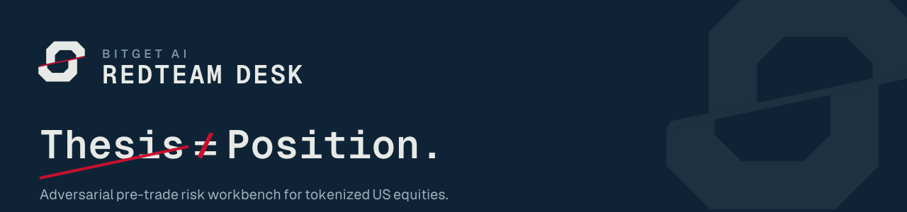

# Bitget AI RedTeam Desk
### Pre-Trade Adversarial Firewall for Tokenized Equities

[](https://github.com/ThatHorseRep/bitget-ai-trading-desk/actions/workflows/ci.yml)
[](https://github.com/ThatHorseRep/bitget-ai-trading-desk)
[](https://redteamdesk.name.ng)

> **"Thesis ≠ Position. Stress-test before the market does."**

Built for the **Bitget AI Base Camp Hackathon S2 — Track 3: Decision Stress Testing**.

---

## Quick Links

- 🌐 **Live Web Application:** [redteamdesk.name.ng](https://redteamdesk.name.ng) *(Mirror: [bitget-ai-trading-desk.vercel.app](https://bitget-ai-trading-desk.vercel.app))*
- 🖥️ **Desktop Video Walkthrough (1080p):** [`public/demo/desktop-demo.mp4`](./public/demo/desktop-demo.mp4) *(Full HD 1080p, 6.35 MB, 100s walk-through with live market data)*
- 📱 **Mobile Video Walkthrough (Portrait):** [`public/demo/mobile-demo.mp4`](./public/demo/mobile-demo.mp4) *(412×914, 4.15 MB, 100s mobile workflow with centered shocks & audio)*
- 📄 **Official Product Specification:** [PRODUCT_DESCRIPTION.md](./PRODUCT_DESCRIPTION.md)
- 🏛️ **Architecture & Engineering Specs:** [docs/specs/](./docs/specs/)

---

## What Problem Does This Solve?

Bitget offers **24/7 trading for tokenized U.S. equities** (such as `rTSLA`, `rNVDA`). However, traditional stock exchanges (NYSE/NASDAQ) are closed for **65.5 consecutive hours every weekend** (Friday 16:00 to Monday 09:30 ET).

During this 65.5-hour void:
1. **Underlying Cash Markets Are Closed:** Real equity price discovery is halted, leaving tokenized wrappers susceptible to severe basis dislocation (un-anchoring from reference assets).
2. **Microstructure Deterioration:** Orderbook depth thins dramatically and spreads widen.
3. **Crypto Contagion:** Weekend crypto volatility shocks (e.g. BTC sudden dump) bleed directly into token equity valuations without corporate fundamental changes.

**The Trap:** Retail traders enter high-notional token positions on weekend social sentiment or rumors, only to suffer massive basis crush when the cash market opens on Monday.

**The Solution:** Bitget AI RedTeam Desk acts as an **adversarial pre-trade firewall**. Before a trader commits capital, the desk isolates their market thesis, validates it against live market state, subjects the position to deterministic arithmetic shock scenarios, and issues an authoritative policy decision (`PROCEED`, `REDUCE`, `WAIT`, `REJECT`).

---

## Why Bitget AI RedTeam Desk Wins Track 3

| Hackathon Requirement | How We Deliver |
| :--- | :--- |
| **Track Fit: Decision Stress Testing** | We do **NOT** build an unconstrained trading bot or speculative price predictor. We provide defensible pre-trade decision stress testing with explicit stop/proceed gates. |
| **Zero-Hallucination Math** | All P&L shocks, basis calculations, slippage estimates, and spreads are computed via **100% deterministic TypeScript arithmetic** (`src/core/scenarios/engine.ts`). The LLM is strictly used for qualitative thesis deconstruction and adversarial counter-arguments. |
| **Full Audit Provenance** | Every single output number links directly back to an **auditable data lineage record** (`OBSERVED_FACT`, `CALCULATED_METRIC`, `SCENARIO_ASSUMPTION`, or `AI_INTERPRETATION`) visible in the interactive Provenance Drawer. |
| **Resilience & Fallback Engineering** | Triple-redundant evaluation pipeline: **Local Qwen-2.5** (primary) $\rightarrow$ **Google Gemini Flash Lite** (auto-failover circuit breaker) $\rightarrow$ **Deterministic Offline Fixtures** (100% offline availability). |

---

## 4 Deterministic Shock Scenarios

When evaluating any proposed trade, the engine runs 4 rigorous stress scenarios:

1. **Market Risk:** Direct adverse reference asset movement (-5%).
2. **Crypto Contagion:** BTC falls -8% while token trades at 0.4 beta to crypto sentiment.
3. **Token Microstructure:** Adverse basis widening by 3 percentage points with 50% orderbook depth reduction.
4. **Combined Shock:** Simultaneous market drawdown, crypto contagion, and liquidity void.

---

## Getting Started

### Prerequisites
- Node.js 22+ (uses native `--env-file-if-exists`)
- [bun](https://bun.sh/) (primary) or npm

### Installation
```bash
bun install
# or
npm install
```

### Configuration
```bash
cp .env.example .env.local
```
Update `.env.local` with your LLM configuration (OpenAI-compatible endpoint, Gemini API key, or Bitget API keys).

### Running Locally
```bash
npm run dev
```
Open [http://localhost:3000](http://localhost:3000) to access the interactive Risk Workbench.

### Running Test Suite
```bash
npm test
# Full verification check:
npm run verify-clean
```

---

## Architecture & Implementation Map

- **Natural Language Parsing & Grammar:** [`src/core/trade/parser.ts`](./src/core/trade/parser.ts) and [`src/core/thesis/extractor.ts`](./src/core/thesis/extractor.ts)
- **Adversarial Red Team Engine:** [`src/core/thesis/challenger.ts`](./src/core/thesis/challenger.ts)
- **Deterministic Scenario Stress Engine:** [`src/core/scenarios/engine.ts`](./src/core/scenarios/engine.ts)
- **Decision Policy & Gate Rules:** [`src/core/decision/policy.ts`](./src/core/decision/policy.ts)
- **Live Bitget Market State Reconstructor:** [`src/services/marketStateService.ts`](./src/services/marketStateService.ts)
- **Provenance & Lineage Tracking:** [`src/core/provenance/tracker.ts`](./src/core/provenance/tracker.ts)
- **Ecosystem Integration Specs (B01-B07):** Documented in [`docs/specs/`](./docs/specs/)

---

## Submission Checklist

- [x] **Track Selected:** Track 3: Decision Stress Testing
- [x] **Functional Web Application:** Deployed at [redteamdesk.name.ng](https://redteamdesk.name.ng) (Mirror: [bitget-ai-trading-desk.vercel.app](https://bitget-ai-trading-desk.vercel.app))
- [x] **Desktop Demo Video:** 100-second 1080p Full HD walkthrough (`public/demo/desktop-demo.mp4`, 6.35 MB)
- [x] **Mobile Demo Video:** 100-second mobile walkthrough with centered shocks & audio (`public/demo/mobile-demo.mp4`, 4.15 MB)
- [x] **Zero TypeScript Errors:** Passing `npm run typecheck`
- [x] **Zero Lint Errors:** Passing `npm run lint`
- [x] **Deterministic Unit Tests:** 100% passing `npm test`
- [x] **GitHub Repo Cleanliness:** All temporary scratch files purged, large binaries ignored
