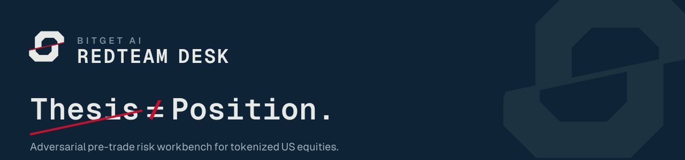

# Bitget AI RedTeam Desk
### Pre-Trade Adversarial Firewall for Tokenized Equities

[](https://github.com/ThatHorseRep/bitget-ai-trading-desk/actions/workflows/ci.yml)
[](https://github.com/ThatHorseRep/bitget-ai-trading-desk)
[](https://redteamdesk.name.ng)

> **"Thesis ≠ Position. Stress-test before the market does."**

Built for the **Bitget AI Base Camp Hackathon S2 — Track 3: Decision Stress Testing**.

---

## Quick Links

- 🌐 **Live Web Application:** [redteamdesk.name.ng](https://redteamdesk.name.ng) *(Mirror: [bitget-ai-redteam-desk.vercel.app](https://bitget-ai-redteam-desk.vercel.app))*
- 🖥️ **Embedded Walkthrough & Video Demos:** Interactive terminal player with chapter cues on the landing page ([#demo-walkthrough](https://redteamdesk.name.ng/#demo-walkthrough)), plus standalone downloads in [`public/demo/brand-desktop-demo.mp4`](./public/demo/brand-desktop-demo.mp4) (Desktop brand cut, 1280×720, 6.8 MB) and [`public/demo/brand-mobile-demo.mp4`](./public/demo/brand-mobile-demo.mp4) (Portrait brand cut, 1080×1920, 14.3 MB)
- 📄 **Official Product Specification:** [PRODUCT_DESCRIPTION.md](./PRODUCT_DESCRIPTION.md)
- 🧾 **Problems Faced & Solved (Engineering Log):** [docs/PROBLEMS_AND_SOLUTIONS.md](./docs/PROBLEMS_AND_SOLUTIONS.md) — every problem → root cause → fix → verification, with commits and test proof
- 📚 **Full Documentation Index:** [docs/README.md](./docs/README.md) — every doc in the repo, organized by audience
- ✅ **Submission Sign-Off (2026-09-30):** [docs/SUBMISSION_SIGNOFF.md](./docs/SUBMISSION_SIGNOFF.md) — audit scorecard, proof table (every claim → observable), remaining human items
- 📊 **Shock Calibration Methodology:** [docs/SHOCK_CALIBRATION_METHODOLOGY.md](./docs/SHOCK_CALIBRATION_METHODOLOGY.md)
- 📜 **Illustrative Scenario Walkthroughs (engine-executed):** [docs/RETROSPECTIVE_CASE_STUDIES.md](./docs/RETROSPECTIVE_CASE_STUDIES.md)
- 🏛️ **Engineering Docs:** [docs/README.md](./docs/README.md)

---

## What Problem Does This Solve?

Bitget offers **24/7 trading for tokenized U.S. equities** (such as `rTSLA`, `rNVDA`). However, traditional stock exchanges (NYSE/NASDAQ) are closed for **65.5 consecutive hours every weekend** (Friday 16:00 to Monday 09:30 ET).

During this 65.5-hour void:
1. **Underlying Cash Markets Are Closed:** Real equity price discovery is halted, leaving tokenized wrappers susceptible to severe basis dislocation (un-anchoring from reference assets).
2. **Microstructure Deterioration:** Orderbook depth thins dramatically and spreads widen.
3. **Crypto Contagion:** Weekend crypto volatility shocks (e.g. BTC sudden dump) bleed directly into token equity valuations without corporate fundamental changes.

**The Trap:** Retail traders enter high-notional token positions on weekend social sentiment or rumors, only to suffer massive basis crush when the cash market opens on Monday.

**The Solution:** Bitget AI RedTeam Desk acts as an **adversarial pre-trade firewall**. Before a trader commits capital, the desk isolates their market thesis, validates it against live market state, subjects the position to deterministic arithmetic shock scenarios, and issues an authoritative policy decision (`PROCEED`, `REDUCE`, `WAIT`, `REJECT`).

---

## Track Fit: Decision Stress Testing

| Hackathon Requirement | How We Deliver |
| :--- | :--- |
| **Track Fit: Decision Stress Testing** | We do **NOT** build an unconstrained trading bot or speculative price predictor. We provide defensible pre-trade decision stress testing with explicit stop/proceed gates. |
| **Zero-Hallucination Math** | All P&L shocks, basis calculations, slippage estimates, and spreads are computed via **100% deterministic TypeScript arithmetic** (`src/core/scenarios/engine.ts`). The LLM is strictly used for qualitative thesis deconstruction and adversarial counter-arguments. |
| **Full Audit Provenance** | Every single output number links directly back to an **auditable data lineage record** (`OBSERVED_FACT`, `CALCULATED_METRIC`, `SCENARIO_ASSUMPTION`, or `AI_INTERPRETATION`) visible in the interactive Provenance Drawer. |
| **Resilience & Fallback Engineering** | Triple-redundant evaluation pipeline: **Local Qwen-2.5** (primary) $\rightarrow$ **Google Gemini Flash Lite** (auto-failover circuit breaker) $\rightarrow$ **Deterministic Offline Fixtures** (100% offline availability). |

---

## Deterministic Shock Scenarios

When evaluating any proposed trade, the engine runs four quantitative stress scenarios plus one qualitative check ([`src/core/scenarios/engine.ts`](./src/core/scenarios/engine.ts)):

1. **Market Risk:** Direct adverse reference asset movement (-5%).
2. **Crypto Contagion:** BTC falls -8% while the token moves at its asset-calibrated beta (rNVDA 0.2, rTSLA 0.4, rMSTR 0.85 — `ASSET_RISK_PROFILES`).
3. **Token Microstructure:** Adverse basis widening by 3 percentage points with 50% orderbook depth reduction.
4. **Combined Shock:** Simultaneous market drawdown, crypto contagion, and liquidity void.
5. **Thesis Failure (qualitative):** The stated catalyst or key dependency fails — judged against the extracted thesis, never mapped to an invented price shock.

Every parameter's derivation and assumption status is documented in [`docs/SHOCK_CALIBRATION_METHODOLOGY.md`](./docs/SHOCK_CALIBRATION_METHODOLOGY.md).

---

## Getting Started

### Prerequisites
- Node.js 22+ (uses native `--env-file-if-exists`)
- [bun](https://bun.sh/) (primary) or npm

### Installation

> Contribution setup, test conventions, and the repo's integrity rules: [CONTRIBUTING.md](CONTRIBUTING.md).
```bash
bun install
# or
npm install
```

### Configuration
```bash
cp .env.example .env.local
```
Update `.env.local` with your LLM configuration (OpenAI-compatible endpoint, Gemini API key, or Bitget API keys).

### Running Locally
```bash
npm run dev
```
Open [http://localhost:3000](http://localhost:3000) to access the interactive Risk Workbench.

### Running Test Suite
```bash
npm test
# Full verification check:
npm run verify-clean
```

---

## Architecture & Implementation Map

- **Natural Language Parsing & Grammar:** [`src/core/trade/parser.ts`](./src/core/trade/parser.ts) and [`src/core/thesis/extractor.ts`](./src/core/thesis/extractor.ts)
- **Adversarial Red Team Engine:** [`src/core/thesis/challenger.ts`](./src/core/thesis/challenger.ts)
- **Deterministic Scenario Stress Engine:** [`src/core/scenarios/engine.ts`](./src/core/scenarios/engine.ts)
- **Empirical Shock Calibration:** [`docs/SHOCK_CALIBRATION_METHODOLOGY.md`](./docs/SHOCK_CALIBRATION_METHODOLOGY.md)
- **Problems Faced & Solved (Engineering Log):** [`docs/PROBLEMS_AND_SOLUTIONS.md`](./docs/PROBLEMS_AND_SOLUTIONS.md)
- **Documentation Index:** [`docs/README.md`](./docs/README.md)
- **Decision Policy & Gate Rules:** [`src/core/decision/policy.ts`](./src/core/decision/policy.ts)
- **Interactive What-If Sandbox:** [`src/components/workspace/DecisionArtifactView.tsx`](./src/components/workspace/DecisionArtifactView.tsx)
- **Illustrative Scenario Walkthroughs (engine-executed):** [`docs/RETROSPECTIVE_CASE_STUDIES.md`](./docs/RETROSPECTIVE_CASE_STUDIES.md)
- **Live Bitget Market State Reconstructor:** [`src/services/marketStateService.ts`](./src/services/marketStateService.ts)
- **Provenance & Lineage Tracking:** inline in `src/services/decisionDeskService.ts` (`DecisionDeskService.runWorkflow` compiles the artifact's provenance array); the pure ID mapping lives in `src/lib/stressTestFailure.ts` (`provenanceIdFor(...)`); the drawer renders each `prov-source-*`, `prov-calc-*`, `prov-assumption-*`, `prov-ai-*` record with scroll/highlight support.
- **Optional Ecosystem Integrations:** enrichment only, fully classified in [`ARCHITECTURE_AND_LIMITATIONS.md`](./ARCHITECTURE_AND_LIMITATIONS.md)

---

## Submission Status

- **Track Selected:** Track 3: Decision Stress Testing
- **Functional Web Application:** Deployed at [redteamdesk.name.ng](https://redteamdesk.name.ng) (Mirror: [bitget-ai-redteam-desk.vercel.app](https://bitget-ai-redteam-desk.vercel.app))
- **Desktop Demo Video:** Brand-cut 1280×720 walkthrough, 100% live data (`public/demo/brand-desktop-demo.mp4`, 6.8 MB)
- **Mobile Demo Video:** Brand-cut portrait walkthrough with live audio (`public/demo/brand-mobile-demo.mp4`, 14.3 MB) — Act 6 re-rendered 2026-10-01 to the engine-true tolerance verdicts; ships at the full 136.5s capture length
- **Zero TypeScript Errors:** Passing `npm run typecheck`
- **Zero Lint Errors:** Passing `npm run lint`
- **Deterministic Unit Tests:** 100% passing `npm test`
- **GitHub Repo Cleanliness:** All temporary scratch files purged, large binaries ignored

---

## Award Eligibility (per hackathon rules)

Awards are **mutually exclusive**, not stackable:

- **University Special Prize (FUTMINNA):** entered by filling the form's University Name field. If the entry wins a main-track prize (Grand Prize, Theme, or Open Theme), it is **no longer eligible** for the University Special Prize — and vice versa, a University Special Prize win excludes main-track prizes.
- **Best Spread Award** is likewise mutually exclusive with main-track prizes (Grand/Theme/Open).
- The entry competes for **Track 3 (AI Trading Desk) — Decision Stress Testing**; which award it ultimately holds depends on judge outcomes, and the submission does not assume simultaneous stacking.

## License

MIT — see [LICENSE](LICENSE).
